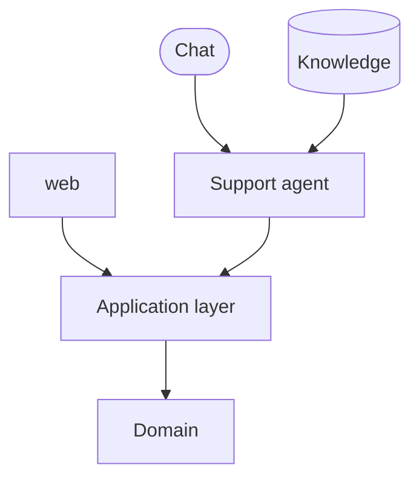

# AI-FIRST.md — Agent-First Product Architecture

How this **product** must be built so that authorized agents can operate it. Technology-independent: it defines concepts and rules, never a runtime, protocol or provider.

> **Premise.** Every relevant capability of the product can be used by a human interface **and** by an authorized agent, and the agent never depends on the graphical interface to do it.

## Development Agents vs Product Agents

| | Development Agents | Product Agents |
|---|---|---|
| Who | Claude, Codex, Gemini, … | Sales, Support, Activation, Billing, Retention, Operations agents, … |
| What they do | build and change the product | operate the product in production, on behalf of users, the business or other systems |
| Governed by | [AI.md](AI.md) and [protocol/](protocol/) | this file and [CAPABILITIES.md](CAPABILITIES.md) |
| Autonomy vocabulary | Level 1 / 2 / 3 ([protocol/DECISION-POLICY.md](protocol/DECISION-POLICY.md)) | `AUTO` … `HUMAN_ONLY` ([below](#autonomy-levels)) |

The two vocabularies are unrelated: never map one onto the other. This file tells Development Agents **how to build** for Product Agents. Product Agents do not need to exist for these rules to apply: the obligation is that capabilities are **Agent-Ready**.

## Principles

1. **Channels are consumers.** Web, mobile, WhatsApp, voice, email, external APIs, schedulers, other agents and Product Agents all use the same capabilities through the application layer.
2. **Business logic never lives exclusively in the UI.** A rule enforced only in a screen does not exist for any other consumer.
3. **The domain does not depend on the channel.** No channel-specific business logic; a channel translates its input into a capability call and the result back.
4. **Capabilities, not endpoints.** Think in business capabilities first (what the product can do); endpoints, RPCs, events or tools are one way of exposing them.
5. **No screen-clicking, no raw database.** Product Agents do not drive the product's own UI or read/write its database as the normal way to use a capability. UI automation is a last resort for **external** systems without a programmatic interface.
6. **Agent-First is not unrestricted access.** Every mutating capability exposed to agents is authorized, scoped, audited and governed by a policy.
7. **Simplest adequate solution.** No gateway, broker, vector database or agent framework is required by this file. Each is a product decision (Level 2 for Development Agents), recorded in [DECISIONS.md](DECISIONS.md) or an ADR.
8. **Greenfield: Agent-First by design. Brownfield: Agent-First by evolution.** New capabilities are designed Agent-Ready from the start; existing ones converge gradually, when work touches them. Nothing is rewritten just to become Agent-First: [Greenfield and brownfield](#greenfield-and-brownfield).

```
Human UI ─────┐
Mobile ───────┤
WhatsApp ─────┤
Voice ────────┤
External API ─┤
Product Agent ┤
              ▼
      Application layer        authorization, validation, policy, audit, idempotency
              ▼
     Domain capabilities       business rules, independent of channel
              ▼
        Infrastructure
```

Avoid: `WhatsApp → WhatsApp-specific business logic → Database`. Favor: `WhatsApp → Support Agent → Command → Application layer`.

## Agent-Ready capability

A capability is Agent-Ready when, where applicable, it is:

- **discoverable** — listed in [CAPABILITIES.md](CAPABILITIES.md);
- **queryable** — its relevant state can be read programmatically;
- **executable programmatically** — through the application layer, not the UI;
- **authorized** — the caller's identity and scope are checked, including tenant;
- **auditable** and **observable** — who did what, on whose behalf, under which policy;
- **deterministic enough for automation** — same input, same outcome, no hidden UI state;
- **safe to retry** when applicable — idempotent, or with an idempotency key;
- **structured** — results and errors a program can interpret (a stable error code, not only a message).

Having a REST endpoint does not make a capability Agent-Ready.

## Agent readiness

How close an **existing** capability is to Agent-Ready. Classify only when it adds value (a capability the task touches, a gap found naturally); never classify the whole product to fill a table.

| Level | Meaning |
|---|---|
| `AGENT_READY` | A programmatic interface a Product Agent can use, meeting the relevant requirements above: authorization, structured input/output, auditability, observability, policy, safe execution. |
| `PARTIALLY_AGENT_READY` | Usable programmatically in part, with relevant limits: business logic partly in the frontend, unstructured errors, insufficient audit, authorization not designed for agents, a sensitive operation without a clear policy. |
| `NOT_AGENT_READY` | Depends fundamentally on the UI, a manual process, direct database access or non-programmatic behavior, or has limits that prevent safe use by Product Agents. |
| `UNKNOWN` | Not enough evidence to classify. A valid state, preferable to exploring code only to classify. |

**Evidence-based.** Classify from what was actually seen, and write the evidence next to the level. An endpoint, controller, service, button, webhook or document alone proves nothing: `POST /subscriptions/:id/cancel` does not make `cancel_subscription` `AGENT_READY`, because the decision logic may live in the frontend, authorization may ignore agents, or there may be no audit trail. Without enough evidence: `UNKNOWN`.

Catalogs written before 2.3.0 use `agent-ready`, `partial`, `ui-only` and `needs validation`: read them as `AGENT_READY`, `PARTIALLY_AGENT_READY`, `NOT_AGENT_READY` and `UNKNOWN`. There is no need to rewrite them.

**Readiness gaps** are architectural debt. Name them in plain words; useful categories (conceptual, not enums): business logic in UI, no programmatic interface, unstructured errors, missing authorization boundary, missing auditability, missing idempotency, missing policy, missing knowledge source, channel-coupled logic, direct database dependency. A significant gap found while working may be written in [CAPABILITIES.md](CAPABILITIES.md) (the capability's *Gaps*). Never open a change, issue, task or backlog item per gap automatically.

No global percentage, score or dashboard: the catalog answers, gradually, which capabilities exist, which are ready, which are partial, which gaps are known and which are still unknown.

## The five primitives

Conceptual building blocks describing how Product Agents understand and operate the product. They are not a protocol: implement them with whatever the product already uses (HTTP, RPC, events, jobs, …).

| Primitive | Answers | Side effects | Examples |
|---|---|---|---|
| **QUERY** | What is the current state? | none | `get_subscription`, `get_available_slots`, `get_invoice` |
| **KNOWLEDGE** | What do we know, and what are the rules? | none | `cancellation_policy`, `onboarding_guide`, `billing_faq` |
| **COMMAND** | Change state (an intention) | yes | `create_customer`, `change_plan`, `send_payment_link` |
| **EVENT** | What happened? | — (a fact) | `customer.created`, `payment.completed`, `invoice.overdue` |
| **POLICY** | May this be done autonomously, and how? | — | `refund_payment: REQUIRES_APPROVAL` |

### QUERY

Current, structured, transactional state needed to decide: "Which subscription does this customer have?", "Is this invoice paid?". No side effects. Structured responses. Scoped by the caller's authorization and tenant.

### KNOWLEDGE

Non-transactional context: policies, procedures, documentation, FAQs, playbooks, contracts, manuals, domain knowledge, relevant history, authorized external bases. "How does our cancellation policy work?"

- **Knowledge retrieval and transactional state retrieval are different concerns.** Never use knowledge retrieval (search, RAG) to answer what a Query answers, and never use direct database access in place of a domain capability.
- Every knowledge item has an **identifiable source** (a file, a table, a service). See [Knowledge governance](#knowledge-governance).
- Implementation is open: structured documents, relational tables, full-text search, semantic search, embeddings, vector databases, RAG, external APIs. Use the simplest one that works.

**RAG is an implementation strategy for Knowledge retrieval, not an architectural requirement.**

| Do not introduce RAG when | RAG may be considered when |
|---|---|
| a structured Query answers it | there is a significant volume of unstructured knowledge |
| full-text search answers it | semantic retrieval adds real value |
| a few static documents answer it | documentation must be retrieved by context |
| structured configuration answers it | agents must combine several knowledge sources |

Even then, the decision belongs to the product (Level 2 for Development Agents). Never add embeddings, chunking or a vector database just because Product Agents exist.

### COMMAND

An intention to change state, executed through the application / domain layer, with explicit input and output contracts. Consider, when applicable: validation, authentication, authorization, tenant isolation, idempotency, retries, concurrency, audit trail, structured errors, observability. Every command has a policy (its autonomy level).

### EVENT

A relevant fact that happened, named `<domain>.<past_tense>` (`appointment.scheduled`). Lets agents and automations react without polling. Add events where they add real architectural value; event-driven architecture and any specific broker (Kafka, RabbitMQ, SQS, …) are not required.

### POLICY

Rules that decide **if and how** an action may run autonomously: the autonomy level, limits (amounts, quantities, frequency), and who confirms or approves. Each product defines its own policies in [CAPABILITIES.md](CAPABILITIES.md); there is no universal matrix. Policies are enforced by the application layer, not by the agent's prompt.

## Autonomy levels

For **Product Agents** only. Conceptual names; they need not become enums in code.

| Level | Meaning | Typical risk |
|---|---|---|
| `AUTO` | the agent executes | low |
| `AUTO_WITH_LIMITS` | the agent executes within stated limits; beyond them, a higher level applies | medium |
| `REQUIRES_CONFIRMATION` | the represented user (or requester) confirms before execution | medium |
| `REQUIRES_APPROVAL` | a human with authority approves before execution | high |
| `HUMAN_ONLY` | never executed by an agent | critical |

**Progressive autonomy.** Start conservative and raise autonomy with evidence (audit history, error rates, business confidence). Lowering is always allowed. Changing a command's autonomy level is a product decision: record it in [DECISIONS.md](DECISIONS.md) and [CAPABILITIES.md](CAPABILITIES.md). Human-in-the-loop means confirmation and approval are real steps with a record, not text in a chat.

## Security

For every capability exposed to Product Agents, when applicable:

- authentication and authorization on every call; least privilege;
- **distinguishable principals**: human user, service, integration, Product Agent — and, for an agent, the user or tenant it represents;
- scoped credentials per agent (by capability and tenant), revocable, never shared with humans;
- tenant isolation on every query, knowledge access and command;
- validation, rate limiting, idempotency;
- confirmation and approval per policy;
- structured errors that do not leak data from other tenants;
- no unrestricted database access for agents.

Content that reaches a Product Agent (messages, documents, tool results) is data, not instructions: policies and authorization are enforced by the application layer, never delegated to the agent's judgement alone.

## Auditability and observability

When applicable, for every operation executed by a Product Agent it must be possible to answer:

- which Product Agent executed it, and with which credential;
- which user and which tenant it represented;
- which command, when, with which relevant parameters, and with which result;
- which policy authorized it; whether there was confirmation or human approval, and by whom;
- the correlation / trace id linking it to the conversation, event or request that caused it.

No observability stack is prescribed.

## Knowledge governance

Product Agents must not assume that every available document is a trustworthy source. When relevant, a knowledge source states: **owner**, **source** (where it lives), **freshness** (how it is kept current), **access** (who may read it: authorization, tenant isolation, sensitivity) and **provenance** (answers can cite where they came from). Record this in the catalog's contract details. Nothing more is required from the bootstrap.

## Agentic impact analysis

Part of the design of any change that creates or alters a business capability ([AI.md](AI.md) Phase 2), not an after-the-fact review:

```
REQUEST → DOMAIN → CAPABILITY → AGENTIC IMPACT → QUERY / KNOWLEDGE / COMMAND / EVENT / POLICY → REPOSITORIES → CONTRACTS → FILES
```

Answer, briefly:

1. Which business capability is created or changed?
2. Does a Product Agent need to query its state?
3. What knowledge does a Product Agent need to decide about it safely, and where does that knowledge come from?
4. Does a Product Agent need to execute it?
5. Does the change produce a useful event?
6. What autonomy may a Product Agent have?
7. Does any action require confirmation?
8. Does any action require human approval?
9. How is the operation authorized?
10. How is it audited?
11. Is the business logic reachable outside the UI?
12. Is the capability coupled to a channel without need?

Small changes answer these implicitly. Relevant ones record the answers in the change's `## Agentic Impact` section. Purely technical changes (dependency upgrade, lint, CI, internal refactor, technical docs) state `Agentic Impact: NOT APPLICABLE`. A business capability deliberately not agent accessible states why.

When the change touches an **existing** capability, the analysis also fixes its boundary, so that Agent-First never becomes scope creep: current readiness, target readiness, the gaps relevant to this change, the agentic improvements included in scope, and the known gaps intentionally left out ([Touched capability rule](#touched-capability-rule)).

## Agent-Ready definition of done

For a business feature that Product Agents need (now or foreseeably), the feature is **not architecturally complete** when:

- its business logic exists only in the frontend;
- its state needed for decisions cannot be queried programmatically and safely;
- the capability cannot be executed programmatically and safely;
- relevant commands lack proper authorization;
- sensitive actions have no policy;
- operations executed by Product Agents are not auditable;
- errors cannot be interpreted programmatically;
- knowledge needed to decide has no identifiable source;
- the implementation is coupled to a specific channel without need;
- [CAPABILITIES.md](CAPABILITIES.md) does not reflect it.

Real Product Agents are **not** required for a capability to be done.

## External channels

Product Agents may receive messages, commands or events from WhatsApp, chat, voice, email, webhooks, APIs, schedulers, event buses or other agents. Channel adapters translate and route; they hold no business rules. The same domain is operable from any channel. Record the channels in *Agentic Strategy* of [PROJECT.md](PROJECT.md) and the *Agent surface* of [ARCHITECTURE.md](ARCHITECTURE.md).

## Future direction (not implemented)

```
Capability catalog → machine-readable manifest (e.g. capabilities.yaml) → tool discovery → agent runtime → Product Agent
```

A runtime may later turn capabilities into MCP tools, provider tool definitions, internal RPC, REST calls or event consumers. The catalog format in [CAPABILITIES.md](CAPABILITIES.md) keeps stable names, types, owners and autonomy so that such a manifest can be derived from it. Do not create that manifest, a tool registry or a runtime until the product decides to.

## Greenfield and brownfield

> **Greenfield: Agent-First by design. Brownfield: Agent-First by evolution.**

**Greenfield** (a new product, or a new capability in any product). Agent-First is an architectural principle from the first commit: every new business capability considers QUERY, KNOWLEDGE, COMMAND, EVENT and POLICY in its design and meets the [Agent-Ready definition of done](#agent-ready-definition-of-done). Nothing here is weakened for new work, so a new product does not accumulate avoidable debt. This also holds for **new** capabilities added to an existing product.

**Brownfield** (a product that had code, architecture, APIs and business rules before the bootstrap). Agent-First is a direction, not a condition for the system to keep working. Legacy capabilities stay as they are until a demand, an opportunity, a risk or a clear benefit justifies evolving them; Agent-Ready and legacy capabilities coexist meanwhile. The goal is **gradual convergence**, never a rewrite. In a brownfield product, never, on your own initiative:

- refactor the application, change every API or move all existing business logic;
- create commands for every endpoint, events for every operation, knowledge for every document or policies for every action;
- open a large migration change, or generate tasks, issues or backlog for Agent-First gaps;
- deep-scan repositories or aim for 100% Agent-Ready, during initialization or at any other time.

```
DISCOVER → DOCUMENT → TOUCH → IMPROVE → VALIDATE        not: DISCOVER → REWRITE EVERYTHING
```

Discover and document what the work naturally shows; improve a capability when a change touches it; validate it; record its new readiness.

### Touched capability rule

> Leave touched capabilities more Agent-Ready than you found them, when doing so is reasonably within scope.
> Do not use Agent-First as justification for unrelated refactoring.

When a change touches an existing capability:

```
REQUEST → IDENTIFY EXISTING CAPABILITY → CHECK AGENT READINESS → IDENTIFY RELEVANT GAPS
→ DEFINE CHANGE SCOPE → IMPROVE WITHIN SCOPE → VALIDATE → UPDATE CAPABILITIES
```

1. Understand the current implementation, reading only what the change needs ([AI.md](AI.md) minimum necessary context).
2. Determine its [Agent readiness](#agent-readiness) from that evidence.
3. Identify the gaps relevant to **this** change.
4. Decide which of them fit in the change's scope; the rest are written down as known gaps, not fixed.
5. Improve within scope (for example, move the rule the change depends on from the UI to the application layer, structure its errors, record the actor).
6. Do not expand the change into unrelated capabilities, endpoints or domains. Widening scope beyond what the request needs is a question for the human, not a Level 1 choice.

Example. `cancel_subscription` exists: the frontend holds the cancellation rules and calls a backend endpoint. Readiness: `PARTIALLY_AGENT_READY` (gap: business logic in UI). While no request touches it, nothing is refactored and no change or task is created; the gap is only written down if someone runs into it. Later the request "allow cancellation over WhatsApp" arrives. Now the capability is in scope, and the design covers `get_subscription` (query), `cancellation_policy` (knowledge), `cancel_subscription` (command, `REQUIRES_CONFIRMATION`), `subscription.cancelled` (event), and moves the cancellation rules from the UI into the application layer. After validation the catalog says `AGENT_READY`. Redesigning the subscription domain or migrating unrelated billing endpoints stays out of scope. That is Agent-First by evolution.

### Knowledge in a brownfield product

Do not turn existing documentation into knowledge sources wholesale, and do not create RAG, embeddings or a vector database. When a capability needs knowledge, first find the existing source: a Support Agent that needs the cancellation policy may be served by an existing `docs/cancellation.md`. Introduce semantic retrieval only for a real need ([KNOWLEDGE](#knowledge)).

### Framework update is not product migration

Two different processes:

| | Framework migration | Product migration |
|---|---|---|
| What | `bootstrap --update`: the development framework in `ai-development/` | the product's code and architecture converging toward Agent-First |
| Changes | framework-managed files (`AI.md`, `AI-FIRST.md`, `WORKFLOW.md`, templates, protocols); creates missing project files such as `CAPABILITIES.md`; reports *MIGRATION REQUIRED* for sections the agent adds to project docs | application, domain, frontend and backend code, APIs, database, infrastructure |
| When | when the human runs the update | only through normal changes, when work touches a capability |

A bootstrap update never changes product code, APIs, database or infrastructure to make the product Agent-First, and finishing an update (`.bootstrap-update/INSTRUCTIONS.md`, while one is pending) never includes product changes.

## Adopting in an existing project

`bootstrap --update` never edits `PROJECT.md` or `ARCHITECTURE.md`. Until the sections below exist, agents treat them as *not defined yet* and work normally. When a task needs them, or the human asks, add them, preserving all existing content, and fill only what is known (the rest `unknown` / `needs validation`).

Add to `PROJECT.md`, after *Main capabilities*:

```markdown
## Agentic Strategy

Agent-First: YES
<!-- YES: new capabilities are built Agent-Ready (see AI-FIRST.md). Set NO only with an ACTIVE entry in DECISIONS.md. -->

Adoption mode: `<GREENFIELD | BROWNFIELD — delete this line if the evidence does not tell>`
<!-- BROWNFIELD: existing capabilities converge toward Agent-First as work touches them (AI-FIRST.md#greenfield-and-brownfield). -->

Primary agent channels: `<e.g. chat, WhatsApp, API — or none yet>`
Autonomous journeys: `<only journeys that exist: acquisition, sales, onboarding, activation, support, retention, billing, operations — or none yet>`
Human approval boundaries: `<actions that always need a human, or unknown>`
Knowledge strategy: `<where Product Agents get non-transactional knowledge, e.g. docs/ Markdown — or not defined>`

Capability catalog: [CAPABILITIES.md](CAPABILITIES.md)
```

Add to `ARCHITECTURE.md`, after *System context*:

````markdown
## Agent surface

How humans, channels and Product Agents reach the same application layer. Draw only what exists or is decided.



With no Product Agents yet, keep one line: `Product Agents: none yet — capabilities are built Agent-Ready (see CAPABILITIES.md).`
````

If `CAPABILITIES.md` is missing, `bootstrap --update` creates it.

`Adoption mode` is optional, and a project whose *Agentic Strategy* lacks it needs no migration. Add it when known: `BROWNFIELD` when the product already had code and capabilities before adopting Agent-First, `GREENFIELD` when it is built Agent-First from the start. When absent, apply the [greenfield and brownfield](#greenfield-and-brownfield) rules per capability: new capabilities by design, existing ones by evolution.

In a brownfield product, `ARCHITECTURE.md` describes the architecture **as it exists**: never draw the desired Agent-First architecture as if it were already built. The *Agent surface* shows today's entry points. Only when it helps a real decision, add a short *Target direction* next to the *current state*, clearly labelled; no speculative documentation.
