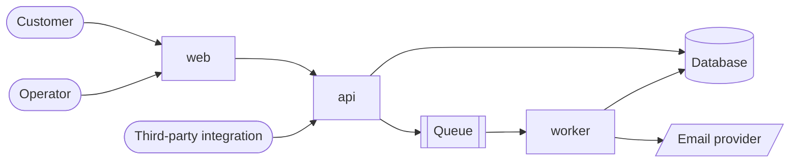
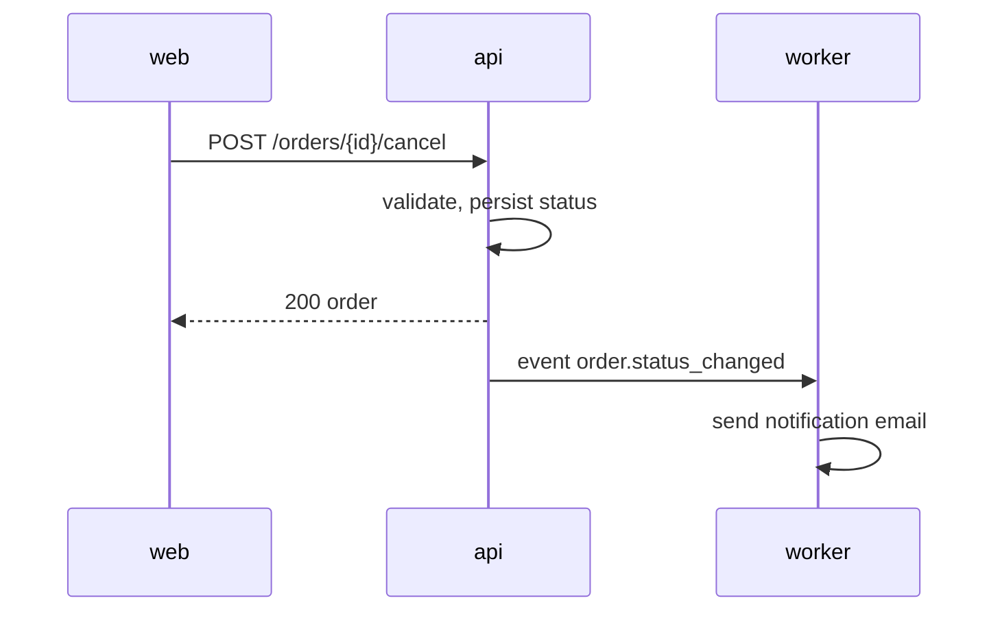

# ARCHITECTURE

Macro view: how systems relate. Internal details live in each repository.

## System context

## Key flows

Order status change with notification:

## Boundaries and rules

- `web` never talks to the database or queue; it only calls the `api`.
- `worker` reads order tables but never writes them; state changes go through the `api`.
- The HTTP API changes additively; breaking changes need a new version.

## Data ownership

| Data | Owner | Others may |
|---|---|---|
| Orders | `api` | `worker` read-only |

## Related

- Domain: [docs/domains/orders.md](docs/domains/orders.md)
- Decision: [docs/adr/0001-use-events-for-side-effects.md](docs/adr/0001-use-events-for-side-effects.md)
