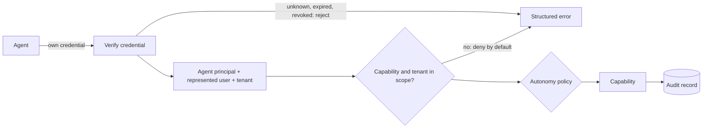

# Design: add-agent-access

> Reference. Describe the product's own design in its terms; keep the requirements, replace the placeholders, drop what does not apply. No technology is prescribed: the mechanism is the answer to the Level 2 question in the proposal.

## Solution

One path for every agent call, at the application layer, before any capability runs:

- **Principal.** `<how an agent principal is represented, distinct from users, services and integrations>`.
- **Credential.** `<mechanism, per the decision>`. One per agent. Stored only as a hash or in a secret store; the value is shown once at issuance, never logged, never returned again.
- **Scope.** Per capability and per tenant; empty scope means no access.
- **Represented user.** Established only from a delegation by that user, never from a user id the agent names: `<user present: the user's own session exchanged by the backend for a short-lived delegated credential | user absent: a recorded consent (agent, user, tenant, scopes, expiry), revocable by the user | both>`. Effective permission = agent scope ∩ delegated scope ∩ that user's current permission. Confirmations required by the autonomy policy are given by the user with their own session, never by the agent.
- **Policy.** The capability's autonomy level (CAPABILITIES.md) is checked here, not in the agent's prompt; confirmation and approval are recorded steps.
- **Audit.** For every call: agent, credential id (never the value), represented user, tenant, capability, result, correlation id.
- **Limits and errors.** Rate limit per credential. Stable error codes; no data from other tenants in any error.
- **Fail closed.** No configuration, no key material or no scope: every agent call is rejected.

## Lifecycle

| Operation | Who | Recorded |
|---|---|---|
| Issue | human administrator | agent, scopes, expiry, issuer |
| Rotate | human administrator | old and new credential ids |
| Expire | automatic, at `<lifetime>` | expiry |
| Revoke | human administrator, effective immediately | revoker, time |
| Delegate to an agent | the represented user | agent, user, tenant, scopes, expiry |
| Revoke a delegation | the represented user or an administrator, effective immediately | revoker, time |

## Existing access (brownfield)

`<The existing agent credential (e.g. a chatbot's), where it is configured (never its value), what it can reach today, and how it becomes an agent principal with the same scope, without interrupting its channel. Or: none.>`

## Contracts

| Contract | Change | Provider → Consumers | Compatibility |
|---|---|---|---|
| `<agent authentication at the application layer>` | added | `<api → agents>` | additive; human authentication unchanged |
| `<credential administration>` | added | `<api → admin>` | additive |

## Decisions

Link each answered question from the proposal: `<DECISIONS.md key or ADR>`. Where the secrets live: `<secret store or environment variable name>` (never the value).

## Risks

| Risk | Mitigation |
|---|---|
| Existing agent channel breaks during migration | migrate its credential to an agent principal with the same scope; verify the channel before removing the old path |
| Over-broad scopes | deny by default; scopes listed per agent and reviewed by a human |
| Secret leakage | hashes or secret store only; no value in logs, responses, repository or change text |

## Validation

- An agent with its own credential calls one capability in scope and succeeds; the audit record has every field above.
- The same agent calls a capability or tenant out of scope: denied, structured error, no foreign data.
- A revoked or expired credential is rejected at once.
- An agent acting for a user never exceeds that user's permission.
- An agent that names a user who did not delegate to it, or whose delegation was revoked or expired, is rejected.
- A human session cannot be used as an agent credential, and an agent credential cannot sign in as a human.
- With the configuration removed, every agent call is rejected.
- *(brownfield)* The pre-existing agent channel still works.
