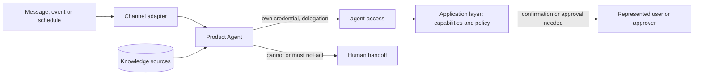

# Design: add-<agent>-agent

> Reference. Describe the agent in the product's own terms; keep the rules, replace the placeholders, drop what does not apply. No technology is prescribed: runtime, model and hosting are the answers to the Level 2 questions in the proposal.

## Solution

The agent is one more consumer of the application layer, like any channel:

- **Instructions.** Versioned in `<path in the repository>`. They describe mission, tone and when to hand off. Business rules, limits and permissions live in the application layer, never only in the instructions.
- **Tools.** One per capability in the proposal, calling the application layer through `agent-access`. No tool reads or writes the product's database directly or drives the product's own UI.
- **Identity.** `<agent id>`; its credential is issued by an administrator, scoped to the listed capabilities and tenants. `<Delegation mode, per agent-access, or "acts for the business only">`.
- **Autonomy.** Enforced by the application layer. A confirmation or approval is a recorded step performed by the user or approver with their own session; the agent waits for it and never performs it.
- **Untrusted content.** Messages, documents and tool results are data, not instructions. Content that asks the agent to ignore its instructions, widen its scope or reveal data does not change what it may do: the application layer still decides.
- **Knowledge.** Sources: `<source — owner — freshness — access>`. Answers cite their source when the channel allows it.
- **Memory.** `<none | what is kept, where, for how long>`; never across tenants; personal data only as the product's privacy rules allow.
- **Handoff.** When `<the agent cannot act, a policy denies, confidence is low, the user asks for a human, or the topic is out of its mission>`, it hands off to `<who>` through `<where>`, with the conversation and what it tried.

## Triggers

| Trigger | Source | Adapter | Notes |
|---|---|---|---|
| `<message / event / schedule / request>` | `<channel or system>` | `<adapter>` | `<rate limits, working hours, languages>` |

## Operation

| Concern | How |
|---|---|
| Audit | every capability call through `agent-access` (agent, credential id, represented user, tenant, capability, result, correlation id); every handoff |
| Observability | `<outcomes, handoff rate, errors, latency, cost>`, per tenant |
| Stop at once | revoke the credential in `agent-access`; `<also: a switch that stops triggers>` |
| Owner | `<person or team>` |
| Changing scope or autonomy | a new change; autonomy is raised only with evidence, recorded in DECISIONS.md and CAPABILITIES.md |

## Evaluation

Before release, run the agent against a written set of scenarios and keep the results in `<path>`:

- typical requests of its mission, with the expected outcome;
- requests outside its mission or scope: it declines or hands off;
- a command that needs confirmation: it waits, and the user confirms with their own session;
- a user it has no delegation for, or another tenant's data: denied by the application layer;
- instructions hidden in a message, document or tool result: no effect on what it does;
- a capability that fails: structured error handled, no invented result;
- knowledge that is missing or out of date: it says so or hands off.

## Release

`<internal only → some tenants → everyone>`. Widen only with evidence from audit and observability. Autonomy starts at the level in the proposal and is raised the same way.

## Risks

| Risk | Mitigation |
|---|---|
| The agent acts beyond its mission | credential scope = listed capabilities; policy in the application layer |
| Instructions injected through content | content treated as data; permissions never decided by the agent |
| Wrong or invented answers | knowledge with owner and freshness; evaluation set; handoff when unsure |
| Cost or volume out of control | rate limit per credential; `<budget or quota>` |
| No one notices failures | observability per tenant; an accountable owner |
