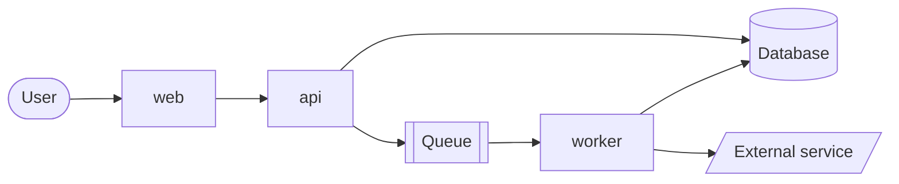
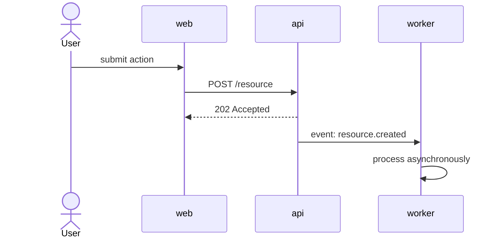
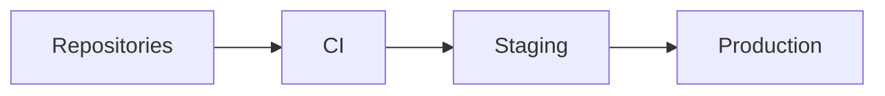

# ARCHITECTURE

> L0 document. Macro architecture only.

This file shows **how systems relate to each other**: who calls whom, what flows where, where data lives. It is not a place for internal implementation details (classes, modules, folder layouts) — those belong in each repository.

If a diagram needs more than ~12 nodes, split it by domain into `docs/architecture/`.

## System context

Replace the example with the real system. Mermaid renders on most Git hosts and editors.

Node names should match the *Repository* column in [REPOSITORIES.md](REPOSITORIES.md) so agents can map a box to a path.

## Key flows

One short sequence per important cross-repository flow. Add a flow when a change would otherwise require reading several repos to understand it.

## Boundaries and rules

Architectural rules that hold across repositories. Keep only real ones.

- `<e.g. web never talks to the database directly>`
- `<e.g. all cross-service communication is via the API or events, never shared tables>`
- `<e.g. contracts are additive; breaking changes require a versioned endpoint>`

## Data ownership

| Data | Owner (repo) | Others may |
|---|---|---|
| `<orders>` | `api` | read via API only |

## Deployment view (optional)

Only if it affects how changes are sequenced (e.g. deploy order, migrations before code).

## Related

- Detailed diagrams: [docs/architecture/](docs/architecture/)
- Decisions and their reasons: [docs/adr/](docs/adr/)
- Domain views: [docs/domains/](docs/domains/)
