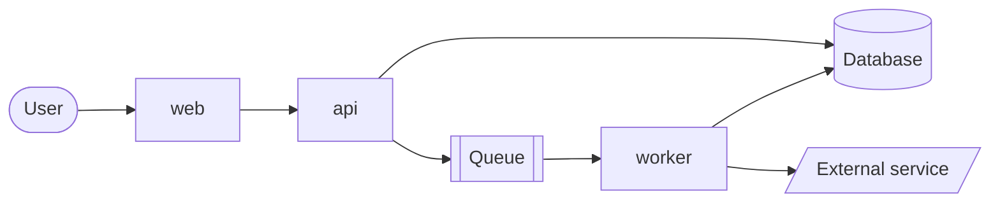
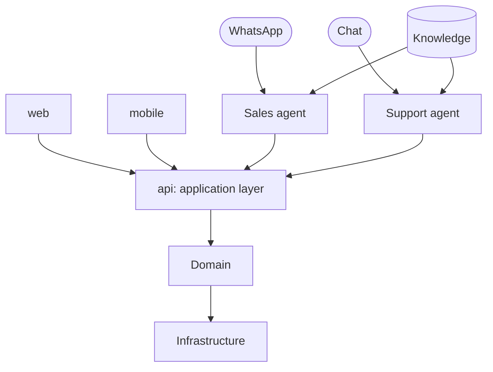
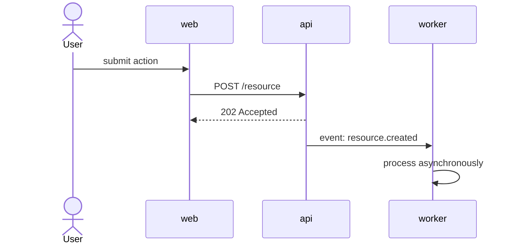
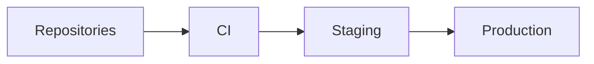

# ARCHITECTURE

> L0 document. Macro architecture only.

This file shows **how systems relate to each other**: who calls whom, what flows where, where data lives. It is not a place for internal implementation details (classes, modules, folder layouts) — those belong in each repository.

If a diagram needs more than ~12 nodes, split it by domain into `docs/architecture/`.

## System context

Replace the example with the real system. Mermaid renders on most Git hosts and editors.

```mermaid
flowchart LR
    User([User]) --> Web[web]
    Web --> API[api]
    API --> DB[(Database)]
    API --> Queue[[Queue]]
    Queue --> Worker[worker]
    Worker --> DB
    Worker --> Ext[/External service/]
```

Draw the architecture **as it exists**. In an existing product, never draw the desired Agent-First architecture as if it were built; add a short, clearly labelled *Target direction* after the current state only when it helps a real decision.

Node names should match the *Repository* column in [REPOSITORIES.md](REPOSITORIES.md) so agents can map a box to a path. Draw only relations that have evidence; draw uncertain ones as dashed edges (`A -.-> B`) and keep the diagram consistent with REPOSITORIES.md.

## Agent surface

How humans, external channels and Product Agents reach the **same** application layer ([AI-FIRST.md](AI-FIRST.md)). The domain never depends on the channel. Replace the example; draw only what exists or is decided. Gateways, brokers, knowledge stores and agent runtimes appear only if the product has them.

```mermaid
flowchart TB
    Web[web] --> App[api: application layer]
    Mobile[mobile] --> App
    WhatsApp([WhatsApp]) --> SalesAgent[Sales agent]
    Chat([Chat]) --> SupportAgent[Support agent]
    SalesAgent --> App
    SupportAgent --> App
    Knowledge[(Knowledge)] --> SalesAgent
    Knowledge --> SupportAgent
    App --> Domain[Domain]
    Domain --> Infra[Infrastructure]
```

With no Product Agents yet, keep one line: `Product Agents: none yet — capabilities are built Agent-Ready (see CAPABILITIES.md).`

Agent access: `<how an agent principal authenticates and is scoped — agent-access in CAPABILITIES.md; or "Known gap: no agent principal, agents would need a human's credentials — see openspec/changes/add-agent-access/">`

Known gaps: `<premise violations in today's entry points, e.g. "Known gap: <capabilities> reachable only through the web frontend" — or none>`. Record them as gaps, never as a neutral description of the current state ([AI-FIRST.md](AI-FIRST.md#premise-gaps)).

## Key flows

One short sequence per important cross-repository flow. Add a flow when a change would otherwise require reading several repos to understand it.

```mermaid
sequenceDiagram
    actor User
    participant Web as web
    participant API as api
    participant Worker as worker
    User->>Web: submit action
    Web->>API: POST /resource
    API-->>Web: 202 Accepted
    API->>Worker: event: resource.created
    Worker->>Worker: process asynchronously
```

## Boundaries and rules

Architectural rules that hold across repositories. Keep only real ones.

- `<e.g. web never talks to the database directly>`
- `<e.g. all cross-service communication is via the API or events, never shared tables>`
- `<e.g. contracts are additive; breaking changes require a versioned endpoint>`

## Data ownership

| Data | Owner (repo) | Others may |
|---|---|---|
| `<orders>` | `api` | read via API only |

## Deployment view (optional)

Only if it affects how changes are sequenced (e.g. deploy order, migrations before code).

```mermaid
flowchart LR
    Repo[Repositories] --> CI[CI] --> Staging --> Production
```

## Related

- Detailed diagrams: [docs/architecture/](docs/architecture/)
- Decisions and their reasons: [docs/adr/](docs/adr/)
- Domain views: [docs/domains/](docs/domains/)
